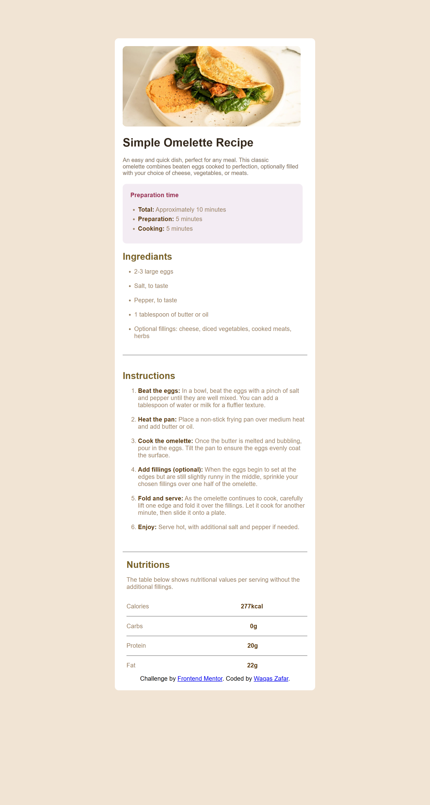

# 🍳 Simple Omelette Recipe Page

This is a solution to the [Frontend Mentor – Recipe Page Challenge](https://www.frontendmentor.io/challenges/recipe-page-KiTsR8QQKm). The project is a static recipe page built with HTML and CSS, based on the desktop version of the design.

---

## 📸 Screenshot

---

## 🔗 Live Demo

[View Live Site](https://github.com/WaqasZafar34/recipe-page.git)

---

## 🚀 Built With

- HTML5 semantic structure
- CSS3 (Flexbox for layout)
- Mobile-first ready structure (but only desktop version done so far)
- Custom styling and colors from challenge style guide

---

## 📚 What I Learned

While building this project, I learned:

- How to structure clean, readable HTML
- How to use Flexbox to align content and control spacing
- How to style sections using padding, margin, and background color
- How to use IDs and classes to apply CSS precisely
- How to organize code into reusable sections (like ingredients, instructions, nutrition)

---

## 📌 To-Do

- [ ] Add responsive design for mobile
- [ ] Add real screenshot in the README
- [ ] Deploy to GitHub Pages (if not yet done)

---

## 🧑‍💻 Author

- GitHub: [https://github.com/WaqasZafar34](https://github.com/yourusername)
- Frontend Mentor: [https://www.frontendmentor.io/profile/WaqasZafar34](https://www.frontendmentor.io/profile/yourusername)

---

## 🎉 Acknowledgments

Thanks to [Frontend Mentor](https://www.frontendmentor.io) for this helpful beginner project and layout inspiration.

---
